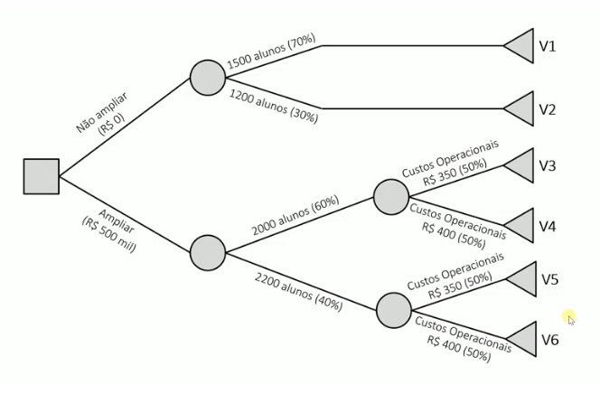
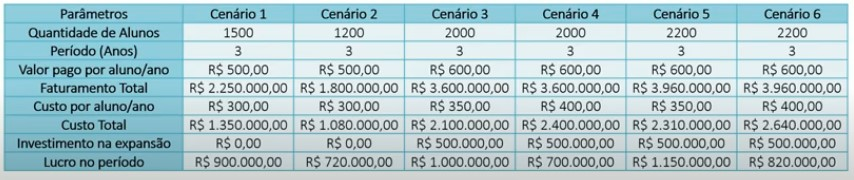
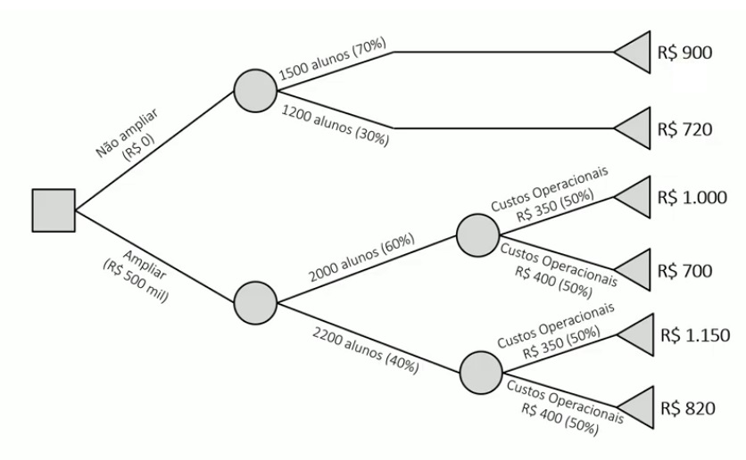
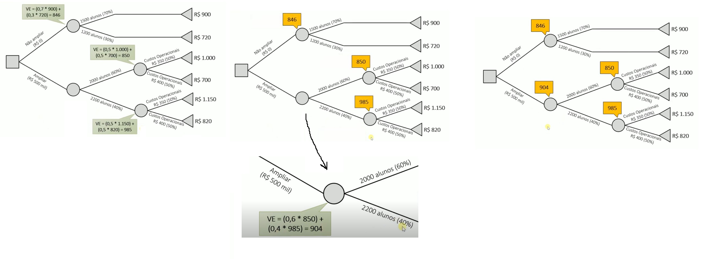

Aula 19

Em el salvador o bitcoin é usado como moeda nacional (2023) - um vídeo de uma sinhorinha comprando ovos com bitcoin

## Árvore de decisão 

Como se aplica a teoria das opções reais em análise de viabilidade utilizando a extensão da metodologia de valor presente e valor futuro (a teoria das opções reais é uma extensão). Para saber como usa isso tem que intender de árvore de decisão.

Vídeo 1: Árvores de Decisão - Exemplo completo com construção e cálculo https://www.youtube.com/watch?v=PCTEn3hWDxA

Para que serve uma Árvore de Decisão?

As árvores de decisão são utilizadas quando você tem um conjunto de alternativas que você pode escolher, com as decisões e você quer calcular o valor esperado para cada alternativa considerando cenários e suas probabilidades

```
As árvores de decisão são utilizadas para calcular o valor esperado de decisões alternativas considerando cenários e suas probabilidades
```

Os seguintes símbolos são usados:


Ex: arvore genérica


sempre começa com um quadrado e apartir do quadrado parte alternativas

Os valores (v1, v2...) devem ser calculados. São os valores que aconteceria se caso um dos cenários acontecesse.

### Exemplo:

Você é o gestor de uma academia que possui atualmente 2.000 alunos, com cada aluno pagando R$ 600 anualmente e custos operacionais de R$ 300 por ano/aluno. A academia possui uma área de musculação, piscina e um estúdio de Pilates.

Um concorrente abrirá uma nova unidade próxima a sua academia, o que reduzirá seu número de alunos, a menos que você amplie suas instalações.

Portanto, você precisa decidir se irá ou não investir em uma expansão de sua academia para manter ou até mesmo aumentar seu número de alunos.

Para tomar essa decisão foram feitas previsões considerando os três próximos anos.


Alternativa 1: Não investir na expansão, porém com redução do valor para R$ 500 e custos mantidos em R$ 300. Espera-se que o número de alunos matriculados caia>

- 1.500 ao longo dos próximos 3 anos (70% de probabilidade)
- 1.200 ao longo dos próximos 3 anos (30% de probabilidade)

Alternativa 2: Investir na expansão, com custos estimados em R$ 500 mil. O efeito esperado na quantidade de alunos será:

- Cenário 1 (60% de probabilidade): manter em 2.000 alunos
- Cenário 2 (40% de probabilidade): aumentar para 2.200 alunos

Com a ampliação os custos operacionais serão afetados:

- Cenário 1 (50% de probabilidade): custos operacionais aumentam para R$ 350
- Cenário 2 (50% de probabilidade): custos operacionais aumentam para R$ 400



#### Resolução do Exemplo: como calcular os valores

O primeiro passo é calcular os valores que seriam obtidos caso cada ramo da árvores acontecesse,  sem considerar nenhuma das probabilidades





Agora precisa fazer o calculo dos valores esperados: Você vai percorer o caminho inverso (ir dos terminadores até a raíz) sempre que você encontra um cenário você vai fazer o calculo do valor esperado.

O calculo do valor esperado: é o valor da probabilidade vezes o valor final.



#### Análise dos Resultados

O tomador de decisão neutro ao risco optaria por investir na ampliação da academia, pois o Valor Esperado é o maior. (isso não quer dizer que essa decisão vai levar para o melhor resultado final)

Se usássemos o critério maximin (maximizar o menor ganho), comum em decisões mais conservadoras, decidiríamos por não ampliar a academia. (Por que no pior cenário das duas alternativas ele tem o valor mais alto)

Se o tomador de decisão for propenso ao risco, escolheria ampliar a academia se usasse o critério maximax (maximizar o maior ganho). (Qual é o maior valor possível dentre todas as alternativas. Que é o caso do tomador de decisão otimista)


Vídeo 2:
