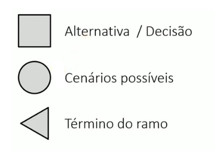
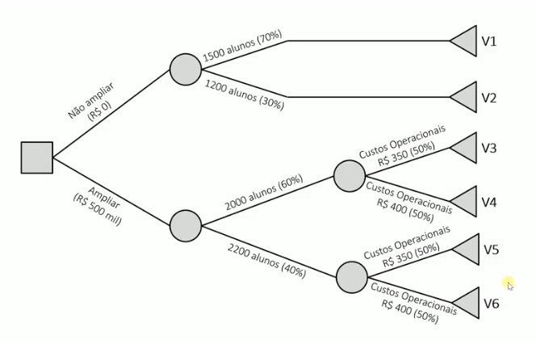

Aula 19

Em el salvador o bitcoin é usado como moeda nacional (2023) - um vídeo de uma sinhorinha comprando ovos com bitcoin

## Árvore de decisão 

Como se aplica a teoria das opções reais em análise de viabilidade utilizando a extensão da metodologia de valor presente e valor futuro (a teoria das opções reais é uma extensão). Para saber como usa isso tem que intender de árvore de decisão.

Vídeo 1: Árvores de Decisão - Exemplo completo com construção e cálculo https://www.youtube.com/watch?v=PCTEn3hWDxA

Para que serve uma Árvore de Decisão?

As árvores de decisão são utilizadas quando você tem um conjunto de alternativas que você pode escolher, com as decisões e você quer calcular o valor esperado para cada alternativa considerando cenários e suas probabilidades

```
As árvores de decisão são utilizadas para calcular o valor esperado de decisões alternativas considerando cenários e suas probabilidades
```



Ex: arvore genérica




sempre começa com um quadrado e apartir do quadrado parte alternativas

Os valores (v1, v2...) devem ser calculados. São os valores que aconteceria se caso um dos cenários acontecesse.


Os seguintes símbolos são usados:


Vídeo 2:
