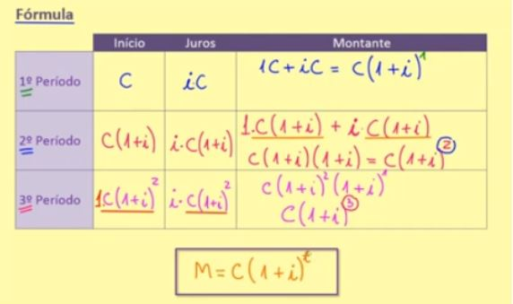

Trocas temporais

O tema principal que conduz toda a finança é o VALOR.


troca intertemporal:

São escolhas no tempo definidas em duas modalidades:
 a) a posição credora; e b) a posição devedora.

	- Posição credora: faz um sacrifício agora para ter um benefício no futuro. ou seja, algum custo no presente, tendo em vista um benefício futuro.

	- Posição devedora: Aceita um valor agora para depois ter um custo no futuro. Ou seja, viver agora pagar depois.


TERMOS DE TROCA (entre presente e futuro) – A cada uma dessas
posições corresponde uma proporção entre valores presentes e valores
futuros.

Na posição credora é a proporção de valor que eu cedo no presente (o
custo) e o benefício que eu pretendo ter no futuro. É o benefício adicional: que eu espero obter em relação ao custo que eu tive agora. Ou seja, é a “recompensa de espera”.

Na posição devedora o termo de troca é o “preço da impaciência”.
Quanto maior a minha urgência, maior será o preço que eu deverei pagar
para obter aquilo que eu desejo imediatamente.

termos de troca presente/futuro:
	- Posição credora: É a recompensa da espera
	- Posição devedora: É o preço da impaciência(maior a urgência em relação ao preço que vai pagar no futuro)

	1 - o juros monetário é apenas uma manifestação particularizada de um fenômeno que é mais amplo
	(O juros monetário são apenas manifestação do fenômeno (recompensa da espera e preço da impaciência) nas situações envolvendo trocas temporais com o denominador comum que é o dinheiro.

	- toda vez que existe uma troca no tempo existe uma noção de juros 

	2 - Não a nada de errado com a posição credora e devedora. Ambus são perfeitamente racionais desde que os termos de troca seja adequados.


Troca Intertemporal ≠ Escolha Intertemporal
uma coisa é a troca e a outra coisa é a escolha
	a escolha depende de um ato voluntário
	Pq os indivíduos diferem tanto em relação a escolhas? (alguns são capases de fazer sacrifícios e outros sucubem) 
		sociedades que poupam e sociedade que se endividam 	
	A cada etapa de um indivíduo (infância, juventude, maturidade, velhice) - tem um modo particular de fazer escolhas no tempo.
	Aos 4 anos - as crianças não esperam
	Aos 12 anos - 60% esperam
	juventude - aumento da impulsividade para reprodução. Nesse ambiente é que o indivíduo é chamando para fazer
	escolhas de longo alcance para a sua vida.(uma mistura explosiva de confiança no futuro e impulsividade) - é o momento do empreendedorismo
	maturidade - é a ressaca. O período de avaliação.
		mesmo na maturidade existem armadilhas.

OBS: As empresas também têm um ciclo de vida
	nascem (startup)
	crescem
	amadurecem
	ou renovam ou extinguem 


(NO brasil as instituições são tão fraudulentas que o valor poupado pode não ser entregue)
(Quanto maior a escolaridade da mãe melhor o resultado da criança em provas)

	
	Na medida que o momento da escolha se aproxima do presente vai se alterando as percepções
	do termo de troca de presente e futuro. E na hora H da escolha acontece uma total subversão 
	daquilo que parecia racional quando o momento era longo.

Formação das preferências temporais


distribuição de valor no tempo:


O que é mais fácil no mundo do que poupar o dinheiro que ainda não recebeu.
	É muito diferente em fazer uma escolha a distância do que fazer uma escolha na hora h quando
o prazer está imediatamente ao seu alcance.

	
	A disjuntiva: - colocar mais vida nos nossos anos ou colocar mais anos nas nossas vidas.
Viés do presente (desconto intertemporal) - Temos a tendência de dar um peso maior a recompensas no tempo presente (impulsividade e inclinação da gratificação imediata)
(desconto hiperbólico) - Quando as recompensas se encontram muito no futuro elas deixam de ser valiosas para nós.(temos a tendência) - seres humanos estão mais motivados por aquilo que está mais perto de alcançar. 

Não adianta nada você traçar uma meta para daqui a 20 anos. Você tem que quebrar em pedacinhos para daqui a uma hora (a maioria das pessoas não vão brigar para uma meta muito longa)
Objetivos de 30 anos.
30 anos -> 5 anos -> 1 ano -> 1 mês -> 1 semana -> 1 dia 

Investir não é apenas para rentabilidade, também é para manter o seu dinheiro seguro e evitar gastos.


==========================================


A selec é a taxa de juros oficial (2021)


Azul - Representa o Risco dos países emergentes (EMBI) - é um índice de comparação dos títulos dos mercados emergentes em comparação com o título da dívida do tesouro americano. Se esse índice cai significa que esse país deixa de ser um risco. Se esse índice aumenta, o risco do país aumenta.

Vermelho - A capitalização da curva de mercado da bovespa (o valor das empresas na bolsa brasileira). com a crise de 2008 perdeu os valores.

Quando o juros é alto o futuro fica muito caro e muito distante. Quando o juros é alto tudo que tá no futuro vale mais.
Não só o PIB alto é que garante o valor deve ter o juros baixo.
Dominância fiscal - é o termo a dívida pública é tão grande que ela se torna um fator preponderante para determinação dos juros (até mais que a inflação e do nível de atividade).(Em muitas situações o tesouro nacional precisa pagar mais juros que a taxa selic para manter a rolagem de seus papeis)


===========================================

A crise de 2008 foi o estopim para emergir as criptomoedas

Centralized Finance (CeFi) 

Decentralized Finance (DeFi) - decentralisado, computação distribuida, sem intermediários

Platify - Sistema financeiro das Plataformas (Amazon, Facebook) - (Pesquisa do professor)


11:35

===================================

O padrão monetários hoje FIAT (Banco central)

- O valor de uma empresa é subjetivo. Depende do que o mercado acha qual é o valor.


Valor presente e valor futuro

- A valorização da empresa só vale o que ela irá receber no futuro.

- A taxa de juros é fundamental pois a taxa de retorno (para calcular a taxa de desconto)

Ta taxa de desconto impacta no vpl do projeto

VPL negativo é quando o projeto é inviável

A taxa mínima de atratividade geralmente é baseada na polpança e no tesouro direto 

(Esse calculo básico é uma parte do curso. Viabilidade economica financeira é um pouco mais que isso)

<!--
NFT e Bitcoin
arte e lavar dinheiro estão de mãos dadas. (Não é fácil precificar o valor da arte)


NFT - escassez digital

o conceito de valor é subjetivo

- Por outro lado é uma forma do artista ser pago
- Porém as pessoas estão mais preocupadas com a especulação que com a obra em sí.
-->


===================

SELIC -> Taxa livre de risco (banco central) - Para investir no negócio (no brasil - 2023) ele deve pagar no mínimio um pouco mais que a SELIC. 

Nos EUA é diferente depois 2008 eles deixaram de só ver um indicador equivalente da Selic e eles passaram a verificar 3 texas.

Modelo CAPM -> vai calcular o prêmio pelo risco

Se você investe em mais de uma ação o nível de risco diminui. (Efeito da diversificação)

WACC - Custo médio ponderado de capital

custo de capital - O quanto a empresa está pagando pelas suas operaçãoes


WACC -> Cost of equity capm + cost of debt

Em uma economia que o custo de capital é maior que a taxa de retorno. Os investidores não vão querer investir no mercado.

ROI

ROIC -> Retorno sobre capital investido -> Ingloba todo o capital da empresa tanto quanto o capital próprio quanto o capital de terceiro. (quanto maior melhor)

===============

curiosidade:

Fraude Americanas e Ambev (2023)

Risco Sacado:


===============================================================

## Juros Compostos

Capital (C) - capital inicial

Tempo (T) - 

Juros (J) - Compensação pelo tempo emprestado.

Taxa (i) - o juros é calculado pela taxa.

Montante (M) - Capital + Juros


A diferença entre juros simples e juros compostos é que a taxa incide sempre sobre o valor atual enquanto no juros simples a taxa incide sempre no valor inicial.





Juros Simples
Não é usado nas aplicações financeiras


Capital (C) - capital inicial

Tempo (T) - 

Juros (J) - Compensação pelo tempo emprestado.

Taxa (i) - o juros é calculado pela taxa.

Montante (M) - Capital + Juros

Na hora do resgate você recebe o seu capital + Juros = Montante (M)

No juros simples a taxa sempre será incidida sobre o capital inicial e não sobre o montante.


M = C + J => M = 1000 + 300 = 1300 reais.


Essa simples transformação serve para juros simples mas não para juros compostos


======================================

CAPM  = COST OF EQUITY + COST OF DEBT 

WACC - CUSTO MÉDIO PONDERADO DE CAPITAL

Derivativas - alternativa financeira - esteve por tráz da crise de 2008

Derivativos:

Você transfere os riscos de um agente para outro.

- O estopim da crise de 2008 foi que não tinha mais dinheiro para comprar mais CDI.

Opções financeiras

Seguradoras

=============================================
Aula 15

União de finansas corporativas de estratégia com teoria dos jogos estratégica

A teoria dos jogos é baseada: no DILEMA DOS PRISIONEIROS e no EQUILÍBRIO DE NASH

A teoria dos jogos é um ramo recente da matemática surgida nos anos 1930. Estuda situações estratégicas onde jogadores escolhem diferentes ações na tentativa de melhorar o desempenho. Como nos jogos: xadrês, bolinha de gude... A teoria dos jogos é muito útil no investimento de ações, a competição de empresas na conquista de um mercado, na eleições e até mesmo nas querras.


## DILEMA DOS PRISIONEIROS

```
O dilema dos prisioneiros é um problema clássico da teoria dos jogos que explora a dinâmica de escolhas racionais em situações de conflito e cooperação.

O problema é o seguinte: dois criminosos são presos e mantidos em celas separadas, sem comunicação entre eles. Ambos são acusados do mesmo crime e são informados de que, se ambos confessarem, ambos ficam presos por 5 anos. Se ambos negarem os dois ficam presos por 2 anos. No entanto, se um confessar e o outro negar, o que confessou sai livre e o que negou fica preso por 10 anos.

O dilema dos prisioneiros é um exemplo clássico de um jogo de soma zero, em que a soma das perdas e ganhos dos jogadores é sempre zero.

```


Cada tipo de jogo e disputa é um sistema comandado por regras próprias, quem está envolvido no jogo só consegue tomar as decisões corretas quando conhece bem os mecanismos envolvidos na disputa.

Jogo simétrico é um
33:06

